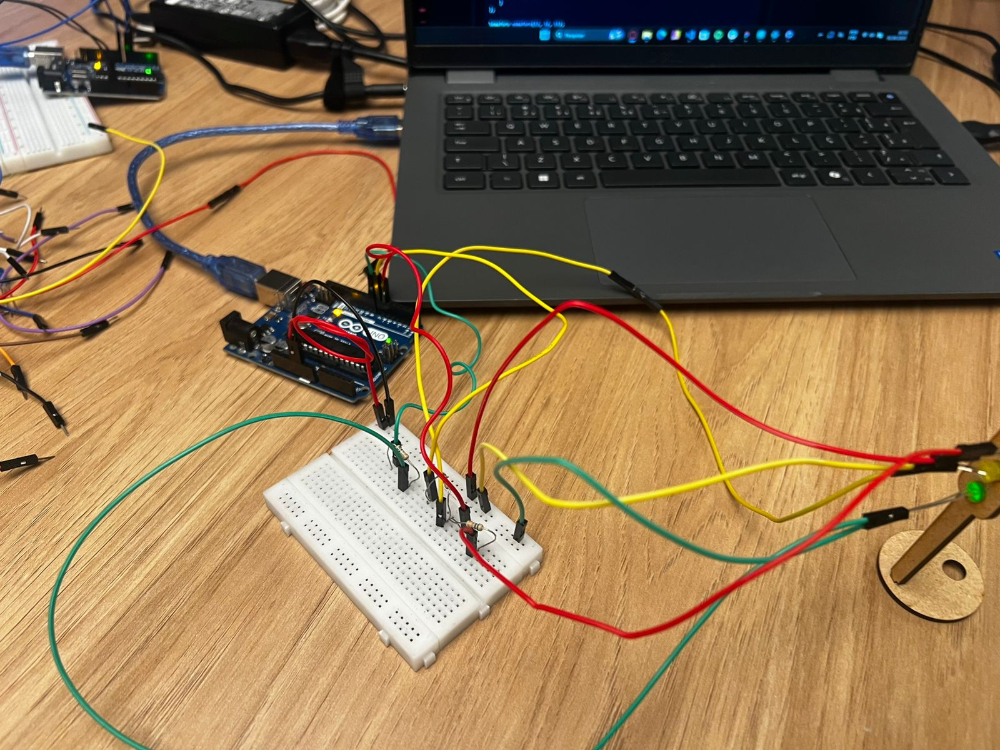
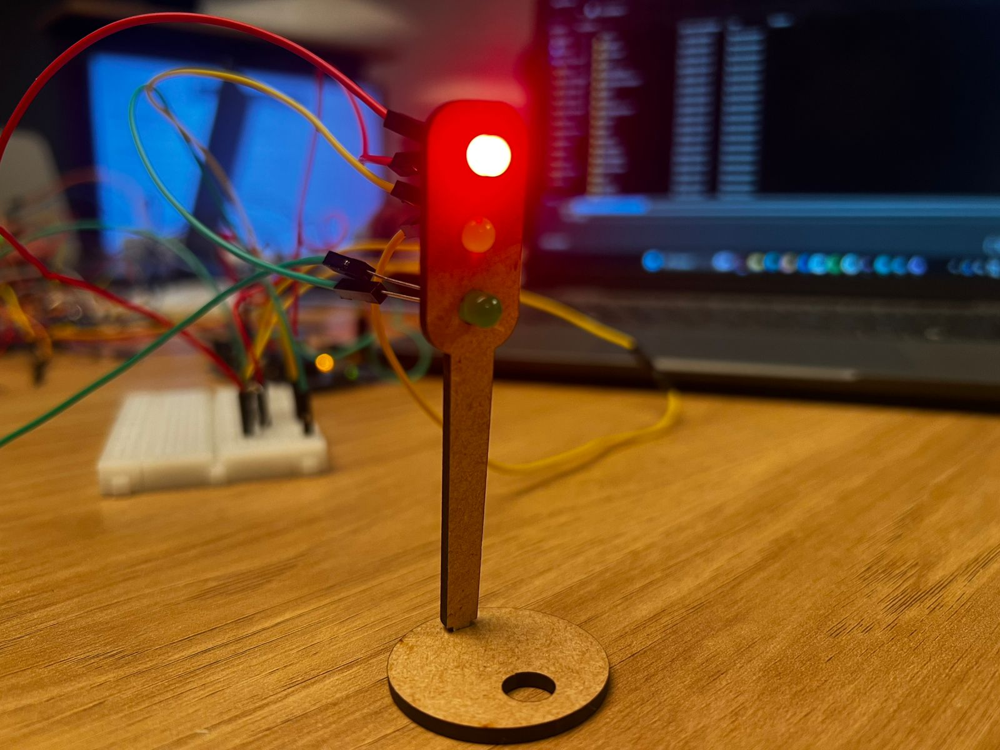

# Ponderada Semáforo

**Nome:** João Pedro Gonçalves Corrêa Araujo
**Turma:** T18

## Descrição

O código apresentado implementa um sistema de controle de LEDs no Arduino utilizando o paradigma da programação orientada a objetos. Ele cria uma classe chamada led, que representa o comportamento e as propriedades de um LED físico conectado a uma porta digital. Dentro dessa classe, o construtor recebe como parâmetro o número da porta e já a configura como saída, permitindo que o LED seja controlado logo após a criação do objeto. A classe também possui dois métodos principais: ligar(), responsável por acender o LED, e piscar(int tempo), que acende o LED, mantém-no ligado pelo tempo especificado em milissegundos e em seguida o apaga.

No início do programa, são declarados três ponteiros para objetos do tipo led, correspondentes às cores vermelho, amarelo e verde. No setup(), esses objetos são instanciados e associados às portas digitais 6, 7 e 8, respectivamente. Já na função loop(), o código executa continuamente uma sequência de acionamento que simula o funcionamento de um semáforo: o LED vermelho acende por quatro segundos, o verde por três segundos e o amarelo por um segundo.

Com isso, o programa demonstra de forma prática como aplicar conceitos de orientação a objetos no Arduino, tornando o código mais organizado, modular e fácil de expandir. Cada LED é tratado como um objeto independente, mas com o mesmo comportamento definido na classe, o que simplifica o controle e a manutenção do sistema.

## Materiais Utilizados

- 3 leds (vermelho, verde e amarelo);
- 6 cabos macho-femea;
- 3 cabos macho-macho;
- 1 arduino uno;
- 1 protoboard pequena;
- 1 semáforo em MDF;
- 1 base para semáforo em MDF;

## Código

```c++
class led {
  private:
    int porta;
  public:

    led(int p) {
      porta = p;
      pinMode(porta, OUTPUT);
    }
    void ligar(){
      digitalWrite(porta, HIGH);
    }
    void piscar(int tempo){
      digitalWrite(porta, HIGH);
      delay(tempo);
      digitalWrite(porta, LOW);
    }
};

led* vermelho;
led* amarelo;
led* verde;

void setup(){
  amarelo = new led(7);
  verde = new led(8);
  vermelho = new led(6);
}

void loop(){
  vermelho->piscar(4000);
  verde->piscar(3000);
  amarelo->piscar(1000);
  
}
```
### Funcionamento


O led Vermelho pisca por 4 segundos.
O led verde pisca por 3 segundos.
O led amarelo pisca por 1 segundo.

**Imagens**

 Abaixo, há imagens do funcionamento do sistema:
<br>
<div align="center">
  <p>Figura 1 - Circuito</p>
</div>
<div align="center">
  
</div>
<div align="center">
  <p>Fonte: Autoria Própria</p>
</div>
<br>
<br>
<div align="center">
  <p>Figura 2 - Semaforo</p>
</div>
<div align="center">
  
</div>
<div align="center">
  <p>Fonte: Autoria Própria</p>
</div>

**Link do vídeo**

https://drive.google.com/file/d/1Ol9CUQCOoQfA6oZber1H94RsfLT4uSbN/view?usp=sharing 